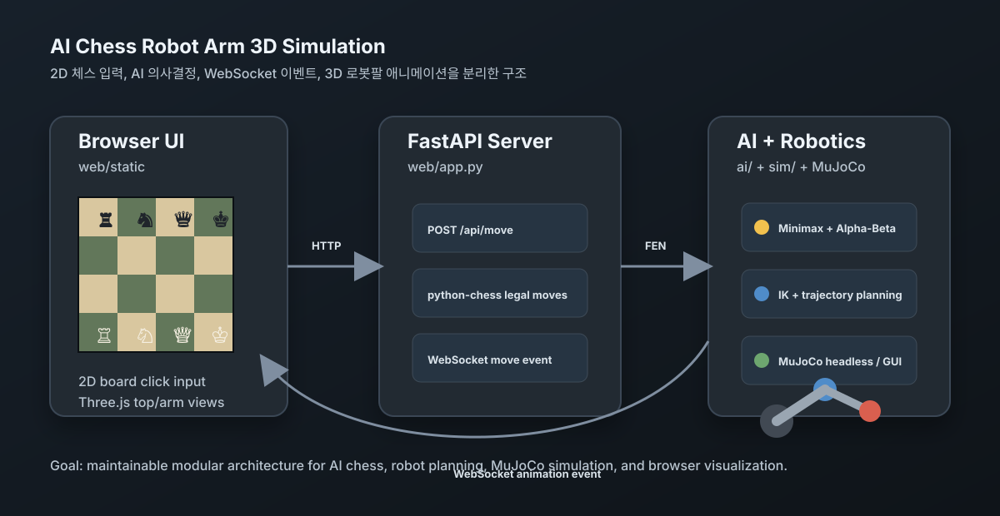

# AI Chess Robot Arm 3D Simulation

Python 기반의 **AI 체스 로봇팔 3D 시뮬레이션 프로젝트**입니다.

사용자는 웹 브라우저의 2D 체스판에서 White로 수를 두고, AI는 Black으로 응수합니다. 각 이동은 우측 Three.js 3D 화면에서 로봇팔이 기물을 집어 옮기는 Pick-and-Place 애니메이션으로 재생됩니다. 별도로 MuJoCo 기반 Headless/GUI 시뮬레이션 코드도 포함되어 있어, 렌더링 없는 대량 실험과 물리 시뮬레이션 확장을 분리해서 가져갈 수 있습니다.



## 주요 기능

- 2D 체스판 클릭 입력
- Three.js 기반 3D 체스판 + 로봇팔 시각화
- Top View와 Robot Arm View 분리 렌더링
- 로봇팔 관절 마커, 작업 반경, 보드 축 가이드 표시
- `python-chess` 기반 합법수 검증
- Minimax + Alpha-Beta Pruning AI
- AI 계산 비동기 처리
- 체크메이트/스테일메이트/무승부 알림 모달
- MuJoCo Headless 모드와 GUI 모드 분리
- Quintic Polynomial 기반 부드러운 궤적 생성기
- `dataclass(frozen=True)` 기반 불변 도메인 모델

## 화면 구성

웹 UI는 좌우 50:50에 가깝게 나뉩니다.

- 왼쪽: 사용자가 직접 조작하는 2D 체스판
- 오른쪽 위: 3D 체스판 Top View
- 오른쪽 아래: 로봇팔 동작을 보기 위한 45도 측면 관찰 View

현재 로봇팔은 Black 진영 뒤쪽에 고정되어 있습니다. 사용자가 White 수를 두면, 로봇팔 애니메이션이 해당 기물을 옮기고 이후 AI의 Black 응수도 같은 방식으로 재생됩니다.

## 빠른 실행

```bash
cd /Users/b/Downloads/ai-chess-robot-sim
source .venv/bin/activate
python -m uvicorn web.app:app --host 127.0.0.1 --port 8000
```

브라우저에서 엽니다.

```text
http://127.0.0.1:8000
```

서버 종료:

```bash
lsof -tiTCP:8000 -sTCP:LISTEN
kill <PID>
```

## 처음 설치하는 경우

Apple Silicon Mac에서는 반드시 arm64 Python 가상환경을 사용해야 합니다. MuJoCo는 x86_64 Python으로 실행할 수 없습니다.

권장:

```bash
cd /Users/b/Downloads/ai-chess-robot-sim
/opt/homebrew/bin/python3 -m venv .venv
source .venv/bin/activate
pip install -r requirements.txt
```

현재 Python 아키텍처 확인:

```bash
file .venv/bin/python
```

정상 예시:

```text
.venv/bin/python: Mach-O 64-bit executable arm64
```

## 실행 모드

### 웹 체스 게임

가장 많이 사용하는 실행 모드입니다.

```bash
python -m uvicorn web.app:app --host 127.0.0.1 --port 8000
```

동작 흐름:

1. 사용자가 2D 보드에서 White 기물을 선택합니다.
2. 이동 가능한 칸이 표시됩니다.
3. 목적지를 클릭하면 서버가 합법수인지 검증합니다.
4. WebSocket으로 이동 이벤트가 브라우저에 전달됩니다.
5. 3D 로봇팔이 기물을 들어 옮깁니다.
6. AI가 Black 수를 계산합니다.
7. AI 수가 다시 3D 로봇팔 애니메이션으로 재생됩니다.

### CLI 체스 게임 검증

웹 UI 없이 체스 엔진과 AI 흐름만 빠르게 확인합니다.

```bash
python scripts/play_cli.py
```

예시:

```text
White move> e2e4
AI(Black): g8h6
White move> g1f3
White move> quit
```

### MuJoCo Headless 모드

렌더링 없이 물리/AI/로봇 루프만 실행합니다. 대량 실험과 성능 측정에 적합합니다.

```bash
python scripts/run_sim.py --headless --steps 1000
```

### MuJoCo GUI 모드

MuJoCo viewer로 물리 모델을 확인합니다.

```bash
python scripts/run_sim.py --gui
```

macOS에서는 MuJoCo GUI가 `mjpython`을 요구합니다. `scripts/run_sim.py`는 `--gui` 실행 시 자동으로 `mjpython`으로 재실행되도록 처리되어 있습니다.

직접 실행:

```bash
.venv/bin/mjpython scripts/run_sim.py --gui
```

## AI 난이도 조절

AI 탐색 깊이는 환경 변수로 조절합니다.

```bash
CHESS_AI_DEPTH=3 python -m uvicorn web.app:app --host 127.0.0.1 --port 8000
```

또는 기본값을 [config/settings.yaml](config/settings.yaml)에서 바꿀 수 있습니다.

```yaml
ai:
  depth: 2
```

깊이를 올리면 더 오래 생각하지만 더 나은 수를 둘 가능성이 높아집니다.

## 프로젝트 구조

```text
ai-chess-robot-sim/
├── ai/
│   └── minimax.py              # Minimax + Alpha-Beta 체스 AI
├── assets/
│   └── mujoco/
│       └── chess_robot.xml     # MuJoCo 체스판/로봇팔 MJCF 예시
├── config/
│   ├── config.py               # YAML 설정 로더와 Settings dataclass
│   └── settings.yaml           # 보드, 로봇, 궤적, AI 설정
├── core/
│   ├── models.py               # frozen dataclass 도메인 모델
│   ├── pieces.py               # 체스 기물 메타데이터
│   └── transforms.py           # 체스 칸 ↔ 3D 좌표 변환
├── docs/
│   ├── architecture.md         # 상세 아키텍처 설명
│   └── images/
│       └── overview.svg        # README 개요 그림
├── scripts/
│   ├── play_cli.py             # 터미널 체스 플레이 검증
│   └── run_sim.py              # MuJoCo 시뮬레이터 실행
├── sim/
│   ├── robot_controller.py     # 로봇 FSM, IK, 특이점 검사
│   ├── simulator.py            # 게임/AI/로봇/MuJoCo 통합 루프
│   └── trajectory.py           # Quintic 궤적 생성기
├── tests/
│   └── test_models.py
├── web/
│   ├── app.py                  # FastAPI + WebSocket 서버
│   └── static/
│       ├── index.html          # 웹 UI 레이아웃
│       ├── main.js             # 2D 보드 + Three.js 렌더링
│       └── styles.css          # UI 스타일
├── requirements.txt
└── README.md
```

## 핵심 데이터 흐름

```text
2D 보드 클릭
  ↓
POST /api/move
  ↓
FastAPI 서버
  ↓
python-chess 합법수 검증
  ↓
보드 상태 갱신
  ↓
WebSocket move 이벤트 전송
  ↓
Three.js 3D 로봇팔 애니메이션
  ↓
AI Minimax 계산
  ↓
AI 이동 이벤트 전송
  ↓
다시 사용자 차례
```

## 체스 규칙 처리

체스 규칙 검증은 직접 구현하지 않고 `python-chess`에 위임합니다.

서버는 현재 보드의 합법수 목록만 허용합니다.

```python
if move not in self.board.legal_moves:
    return {"ok": False, "error": "불법수입니다."}
```

따라서 다음 상황은 자동으로 막힙니다.

- 자기 말이 있는 칸으로 이동
- 중간에 기물이 있는데 룩/비숍/퀸이 통과하려는 이동
- 폰의 잘못된 전진/대각선 이동
- 킹이 체크에 노출되는 이동
- 상대가 공격 중인 칸으로 킹 이동
- 체크 상태를 해소하지 않는 이동

## 게임 종료 알림

게임이 끝나면 초보자도 이해할 수 있도록 모달 알림을 표시합니다.

예시:

```text
Black 승리
Black가 체크메이트로 승리했습니다.
```

지원하는 종료 사유:

- 체크메이트
- 스테일메이트
- 기물 부족 무승부
- 50수/75수 규칙
- 3회/5회 반복
- 기타 python-chess termination

## 3D 렌더링 구조

Three.js는 같은 3D 씬을 두 개의 카메라로 렌더링합니다.

- `Top View`: 보드와 기물 위치 확인
- `Robot Arm View`: 체스판 옆에서 위로 약 45도 기울어진 관찰 시점

3D 로봇팔은 실제 MuJoCo 물리와 완전히 동일한 모델은 아니며, 웹에서 보기 좋은 시각화용 모델입니다. 실제 물리/IK 보일러플레이트는 `sim/`과 `assets/mujoco/`에 분리되어 있습니다.

## 로봇팔 애니메이션

웹 로봇팔은 다음 순서로 움직입니다.

```text
대기 자세
  ↓
출발 칸 상공 이동
  ↓
수직 하강
  ↓
전자석 흡착 가정
  ↓
수직 상승
  ↓
목표 칸 상공 이동
  ↓
수직 하강
  ↓
기물 놓기
  ↓
대기 자세 복귀
```

부드러운 움직임을 위해 quintic smooth step을 사용합니다.

```js
10 * t ** 3 - 15 * t ** 4 + 6 * t ** 5
```

## MuJoCo 시뮬레이션 구조

MuJoCo 쪽은 웹 UI와 별도로 다음 목적을 가집니다.

- Headless 대량 실험
- GUI 물리 모델 확인
- 로봇 IK/궤적 제어 보일러플레이트
- 단순 충돌 primitive 기반 성능 최적화

체스 말의 시각 mesh와 충돌 mesh는 분리하는 방향으로 설계되어 있습니다. 현재 MJCF 예시는 충돌 계산량을 낮추기 위해 원기둥 primitive를 사용합니다.

## 설정 파일

주요 설정은 [config/settings.yaml](config/settings.yaml)에 있습니다.

```yaml
simulation:
  model_path: "assets/mujoco/chess_robot.xml"
  timestep: 0.002
  control_hz: 60
  headless: true

board:
  square_size: 0.06
  origin_in_board_frame: [-0.24, -0.24, 0.02]
  piece_hover_height: 0.12
  piece_pick_height: 0.035

trajectory:
  duration: 1.2
  sample_hz: 60

ai:
  depth: 2
```

## 주요 파일 설명

### [web/app.py](web/app.py)

FastAPI 웹 서버입니다.

- `/`: 웹 UI 반환
- `/api/state`: 현재 보드 상태 반환
- `/api/move`: 사용자 이동 처리
- `/api/reset`: 새 게임
- `/ws`: 상태/이동 이벤트 WebSocket 전송

### [web/static/main.js](web/static/main.js)

브라우저 UI 핵심입니다.

- 2D 체스판 렌더링
- 클릭으로 이동 입력
- WebSocket 이벤트 수신
- Three.js 3D 보드 생성
- 로봇팔 Pick-and-Place 애니메이션
- 게임 종료 모달 표시

### [ai/minimax.py](ai/minimax.py)

체스 AI입니다.

- Minimax
- Alpha-Beta Pruning
- 간단한 기물 가치 평가
- 백그라운드 스레드 실행 지원

### [sim/robot_controller.py](sim/robot_controller.py)

MuJoCo 로봇 제어기입니다.

- 체스 수를 로봇 waypoint로 변환
- Jacobian 기반 Damped Least Squares IK
- Quintic 궤적 프레임 생성
- 전자석 Pick-and-Place FSM
- 특이점 검사

### [core/models.py](core/models.py)

불변 데이터 모델입니다.

- `BoardSquare`
- `Pose3D`
- `ChessMoveCommand`
- `JointTrajectoryPoint`
- `RobotCommandFrame`

## 테스트

```bash
pytest tests/
```

현재 기본 테스트는 불변 모델과 UCI 좌표 변환을 검증합니다.

## 문제 해결

### `No module named fastapi`

가상환경이 활성화되어 있는지 확인하고 의존성을 다시 설치합니다.

```bash
source .venv/bin/activate
pip install -r requirements.txt
```

### MuJoCo Apple Silicon 오류

오류 예시:

```text
You are running an x86_64 build of Python on an Apple Silicon machine.
```

해결:

```bash
deactivate
mv .venv .venv_x86_backup
/opt/homebrew/bin/python3 -m venv .venv
source .venv/bin/activate
pip install -r requirements.txt
```

### macOS에서 MuJoCo GUI 오류

오류 예시:

```text
launch_passive requires that the Python script be run under mjpython on macOS
```

해결:

```bash
.venv/bin/mjpython scripts/run_sim.py --gui
```

또는:

```bash
python scripts/run_sim.py --gui
```

`run_sim.py`가 자동으로 `mjpython` 재실행을 시도합니다.

### 8000 포트가 이미 사용 중

```bash
lsof -nP -iTCP:8000 -sTCP:LISTEN
kill <PID>
```

### 브라우저에서 수정 사항이 안 보임

정적 JS/CSS 캐시가 남아 있을 수 있습니다.

Mac Chrome 기준:

```text
Cmd + Shift + R
```

## 현재 한계와 다음 개선 방향

- 웹 3D 로봇팔은 시각화용 모델이며 MuJoCo IK 결과를 실시간 반영하지는 않습니다.
- AI 평가는 현재 기물 가치 중심이라 Stockfish 수준은 아닙니다.
- 캐슬링, 앙파상, 프로모션은 `python-chess`가 규칙상 처리하지만 UI 선택 경험은 더 개선할 수 있습니다.
- 실제 3D 체스말 mesh와 URDF/MJCF 고정밀 로봇 모델로 교체할 수 있습니다.
- 위험 칸 표시, 체크 알림, 마지막 수 강조, 수순 기록 패널을 추가할 수 있습니다.

## 참고 자료

- [MuJoCo](https://mujoco.org/)
- [python-chess](https://python-chess.readthedocs.io/)
- [FastAPI](https://fastapi.tiangolo.com/)
- [Three.js](https://threejs.org/)

